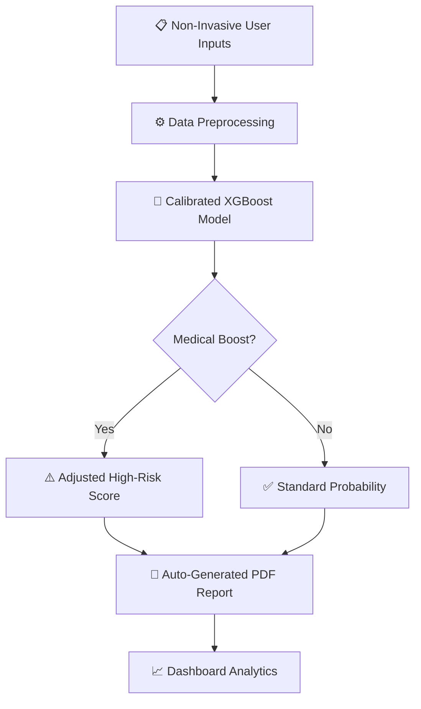

# 🩺 AI-Based Diabetes Risk Prediction System

### *Early Detection of Diabetes & Pre-Diabetes using Machine Learning*

Working Demo - https://diabetesprediction-gbd2ig7hwtdmpusc6rxcjp.streamlit.app/

<div align="center">

</div>

---

## 🌟 Overview

Diabetes affects more than **537 million people** worldwide. Nearly 50% of cases remain undiagnosed due to a lack of awareness and clinical access.

This project presents a non-invasive screening tool that predicts diabetes and pre-diabetes risk probability using survey-based indicators like BMI, lifestyle habits, and mental/physical health scores. The system identifies at-risk individuals, provides personalized health recommendations, and automatically generates clinical PDF reports.

## ✨ Key Features

### 🧠 **Calibrated Machine Learning**

Utilizes a calibrated **XGBoost** model with an optimized decision threshold (0.30) to maximize medical sensitivity and reduce false negatives.

### ⚕️ **Medical-Boost Logic**

A custom safety layer that adds a risk boost (up to +20%) for high-risk profiles, such as those with a BMI > 35, age ≥ 60, or a history of heart disease/stroke.

### 📑 **Automated Reporting**

Instantly generates professional PDF patient reports detailing risk scores, feature analysis, and recommended next steps.

### 📊 **Advanced Analytics Dashboard**

Includes a visual suite for clinicians to evaluate model performance, including:

* 📈 **ROC-AUC Curves**
* 🎯 **Feature Importance Plots**
* 🔥 **Normalized Confusion Matrices**

---

## 🚀 How it Works



---

## 🛠️ Technologies Used

| Category | Tools |
| --- | --- |
| **Deep Learning / ML** | XGBoost, Logistic Regression, SHAP |
| **Deployment** | Streamlit |
| **Report Generation** | ReportLab |
| **Data Processing** | StandardScaler, Pandas, NumPy |
| **Metrics** | ROC-AUC, F1-Score, Precision, Confusion Matrix |

---

## 💻 Setup and Installation

### 📋 Prerequisites

* Python 3.8+
* Virtual Environment (recommended)

### 🔧 Installation Steps

1. **Clone the Repository**:
```bash
git clone https://github.com/ayushkumar-alt/diabetes-early-prediction.git
cd diabetes-early-prediction

```


2. **Create a Virtual Environment**:
```bash
python -m venv venv
# On Windows: .\venv\Scripts\activate
# On macOS/Linux: source venv/bin/activate

```


3. **Install Dependencies**:
```bash
pip install -r requirements.txt

```


4. **Run the Streamlit App**:
```bash
streamlit run diabetes_risk_app/app.py

```


---

## 📁 Project Structure

```text
📂 Diabetes-Risk-Prediction/
├── 📂 data/                    # CDC BRFSS 2015 Public Health Dataset
├── 📂 models/                  # Calibrated weights and scalers
├── 📂 diabetes_risk_app/       # Core application logic
│   ├── 🚀 app.py               # Main UI
│   ├── 📑 pdf_generator.py     # ReportLab logic
│   └── 💡 recommender.py       # Health suggestions
├── 📂 results/                 # Visualization charts (ROC, Matrix)
└── 📓 ML_Project.ipynb         # Model development & research

```

---

## 📈 Model Results

| Model | Recall (At-Risk) | ROC-AUC | Notes |
| --- | --- | --- | --- |
| **Calibrated XGBoost** | **0.69** | **0.81** | **Best for mass screening** |
| Logistic Regression | 0.49 | — | Baseline model |

---

## 🤝 Contributing

Contributions are welcome! Please fork the repository and open a Pull Request for UI improvements, deep learning integrations, or multi-language support.

## 📜 License

This project is licensed under the **MIT License** — free for research, education, and development.

## 👥 Team

* **Ayush Kumar** (2023UG000116)
* **Pruthviraj Shinde** (2023UG000103)
* **Chandrapal** (2023UG000118)

---

<div align="center">

**⭐ If you found this research helpful, please star the repository! ⭐**

*Created for Vidyashilp University — School of Computational & Data Sciences*

</div>
